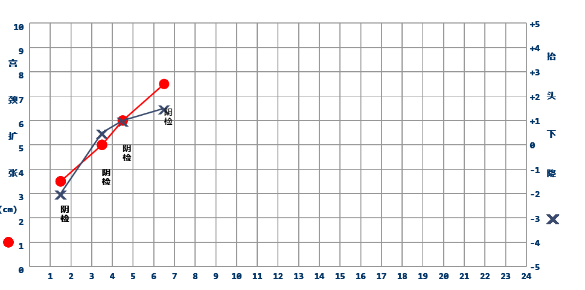

### react-partogram-chart


### Installation

**npm**

```bash
npm install react-partogram-chart --save
```

**yarn**

```bash
yarn add react-partogram-chart --sava
```


### [PlayGround](https://codesandbox.io/s/admiring-waterfall-vrlmr?file=/src/App.js)

### Example

```js
import React, { useState } from 'react'
import C from 'react-partogram-chart'
const d = [
  { checktime: '2019-09-01 07:01', cd: 3.5, df: -2, event: '阴检' },
  { checktime: '2019-09-01 09:01', cd: 5, df: 0.5, event: '阴检' },
  { checktime: '2019-09-01 10:01', cd: 6, df: 1, event: '阴检' },
  { checktime: '2019-09-01 12:01', cd: 7.5, df: 1.5, event: '阴检' },
  { checktime: '2019-09-01 14:01', cd: 8, df: 2, event: '阴检' },
  { checktime: '2019-09-01 15:01', cd: 9, df: 4, event: '阴检' },
]
const App = () => {
  const [data, setData] = useState([])
  return (
    <div style={{ width: '50vw', height: '50vh' }}>
      <C data={data} />
      <button onClick={() => {
        const item = d.shift()
        if (item) {
          setData([...data, item])
        }
      }}>click</button>
    </div>
  )
}

export default App


```

### Props

| Parameter | Description                        | Type    |
| :-------- | :--------------------------------- | :------ |
| data      | chart data                         | IData[]   |

### Parameter Interface
```typescript

export interface IData {
  checktime: string,
  cd: number,
  df: number,
  event: string

}


```


## preview
